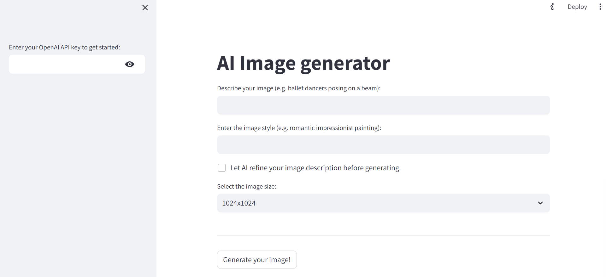

# AI-image-generator
Generates images based on the provided description, style, and size by calling OpenAI APIs.

Run `pip install -r requirements.txt` to install the dependencies.

Then, run `streamlit run main.py` to render the web page.

## Instructions
1. Enter your OpenAI API key to connect to their APIs.
2. Enter the image description.
3. Enter the image style.
4. (Optional) You may ask AI to generate a more detailed prompt based on your description.
5. Select the image size.
6. Click on "Generate your image!".